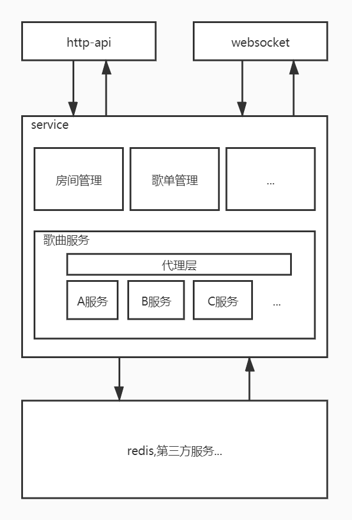

# listen-music
**注意:本项目仅供学习和研究使用,使用本项目造成任何后果本人概不负责**

本项目作为跨平台听歌的后端项目


## 简述
* 项目基于springboot进行开发,与外界交互使用http接口和websocket和外部交互
* 底层直接用redis存储
* 音乐服务均来自第三方
## 灵感来源
### [Jusic-Serve-Houses](https://github.com/JumpAlang/Jusic-Serve-Houses)
学习和研究的过程中,发现不符合本人编码习惯,所以打算重新做一个,重复造轮子什么的最棒了

## 项目结构说明



## 功能
* 用户(会话)
    * [x] 设计
        * ~~简单粗暴,使用 用户->饼干,请求头中给饼干id~~
    * 实现
        *  ] ~~[账号注册~~
        * ~~账号下饼干管理~~
            * ~~[ ] 查看饼干~~
            * ~~[ ] 创建饼干~~
            * ~~[ ] 删除饼干~~
        * [x] ~~拦截请求,获取饼干id~~
        * [x] ~~获取当前会话饼干和用户~~
    * [ ] 重新设计,移除饼干设计,使用 token
    * [ ] 注册
    * [ ] 登录
    * [ ] 拦截token 
* 房间管理
    * [x] 创建房间
    * [ ] 加入房间
    * [ ] 离开房间
    * [ ] 解散房间
* 歌单管理
    * [x] 创建歌单
    * [x] 添加歌曲
    * [x] 移除歌曲
    * [x] 获取歌单信息
    * [x] 获取歌单中的音乐列表
* 歌曲
    * [x] 集成[JsonPath](https://github.com/json-path/JsonPath)
      * 使用配置的方式实现对音乐资源的获取
        * NeteaseCloudMusicApi
            * [x] 获取单个歌曲信息
            * [x] 获取单个歌曲播放地址
            * [x] 搜索歌曲
            * [ ] 搜索歌单
            * [ ] 搜索用户
            * [ ] 标识vip歌曲,防止获取播放地址错误的问题
        * QQMusicApi
            * [x] 获取单个歌曲信息
            * [x] 获取单个歌曲播放地址
            * [x] 搜索歌曲
            * [ ] 搜索歌单
            * [ ] 搜索用户
            * [ ] 标识vip歌曲,防止获取播放地址错误的问题
        * MiguMusicApi
            * [x] 获取单个歌曲信息
            * [x] 获取单个歌曲播放地址
            * [x] 搜索歌曲
            * [ ] 搜索歌单
            * [ ] 搜索用户
            * [ ] 标识vip歌曲,防止获取播放地址错误的问题
* [x] SQLite持久化
* [x] flyway初始化数据库
* [x] ehcache内存缓存
## 项目依赖
* [NeteaseCloudMusicApi](https://github.com/Binaryify/NeteaseCloudMusicApi)
* [QQMusicApi](https://github.com/jsososo/QQMusicApi)
* [MiguMusicApi](https://github.com/jsososo/MiguMusicApi)

## 启动说明
### 1.启动至少一个音乐API服务
* [NeteaseCloudMusicApi](https://github.com/Binaryify/NeteaseCloudMusicApi)
* [QQMusicApi](https://github.com/jsososo/QQMusicApi)
* [MiguMusicApi](https://github.com/jsososo/MiguMusicApi)
### 2.启动本服务
#### 2.1.配置文件说明

```yaml
music-server:
  services: # 对接了哪些音乐服务 type是map
    MiguMusicApi: # 服务唯一键
      enabled: true # 是否启用
      label: 咪咕音乐 # 显示label
      base-uri:  ${MIGU_MUSIC_URI:http://localhost:3400} #访问地址
      api: # api列表
        song: # 获取歌曲详情接口配置
          uri: "/song?id={id}" # uri ,可用参数 id
          method: get # 方法,默认get
          root: "$.data" # JsonPath 根节点的表达式,需要能提取出一个 Object 而非 array
          id: "$.id" # JsonPath 基于根节点的id表达式
          name: "$.name" # JsonPath 基于根节点的id表达式
          artists: # 歌手列表 
            root: "$.artists" # JsonPath 基于根节点的歌手 表达式,需要提取出一个 array
            id: "$.id" 
            name: "$.name"
          process-properties: true 
          # 是否保留额外属性,其他接口有可能需要一些song接口返回的属性,则需要进行提取
          # 见下文 song-lyric.use-properties
          properties-alias:  # 属性 映射
            cid: "$.cid" # key: 基于song根节点的,value的jsonPath表达式
        song-url: # 获取歌曲连接
          uri: "/song/url?id={id}"
          root: "$"
          url: "$.data" # 基于根节点的 url 需要提取出 String
        search-song: # 搜索 
          uri: "/search?keyword={q}&pageNo={pageNum}&pageSize={pageSize}"
          # 可用参数:{q:关键字,limit,offset,pageNum,pageSize}
          root: "$.data"
          total: "$.total" # 总数
          list: # 列表
            root: "$.list"
            id: "$.id"
            name: "$.name"
            artists:
              root: "$.artists"
              id: "$.id"
              name: "$.name"
        song-lyric: # 歌词
          use-properties: true
          # 需要使用额外属性,则会先进行一次song接口的调用(有缓存)
          # 根据song.properties-alias的配置,uri具有额外的可用参数
          uri: "/lyric?cid={cid}" # 使用额外参数 cid 
          root: "$"
          lyric: "$.data"
    NeteaseCloud:
      label: 网易云
      ...
```
#### 2.2.启动步骤
* `mvn clean install` 
* 设置环境变量(根据你的配置文件),默认配置文件有

名称|说明|默认值
-|-|-
MIGU_MUSIC_URI|咪咕api的访问地址|http://localhost:3400
QQ_MUSIC_URI|QQ音乐api的访问地址|http://localhost:3300
NETEASE_CLOUD_URI|网易云api的访问地址|http://localhost:3000

* 运行jar包`java -jar ./target/listen-music-${version}.jar` 
